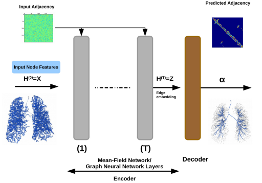

# README #

This is official Pytorch implementation of 
"[Graph Refinement based Airway Extraction using Mean-Field Networks and Graph Neural Networks](https://arxiv.org/abs/1811.08674)", Raghavendra Selvan et al. 2020


### What is this repository for? ###

* Source code for the models described in the paper

### How do I get set up? ###

* Basic Pytorch dependency
* Tested on Pytorch 1.3, Python 3.6 
* Currently the clinical data used cannot be made public. We are working on making it available. 

### Usage guidelines ###

* Kindly cite our publication if you use any part of the code
```
@article{raghav2020graphRefinement,
 	title={Graph Refinement based Airway Extraction using Mean-Field Networks and Graph Neural Networks},
	author={Raghavendra Selvan and Thomas Kipf and Max Welling and Antonio Garcia-Uceda Juarez and Jesper H Pedersen and Jens Petersen and Marleen de Bruijne},
 	journal={Medical Image Analysis,
	year={2020}}}
```

### Who do I talk to? ###

* raghav@di.ku.dk


